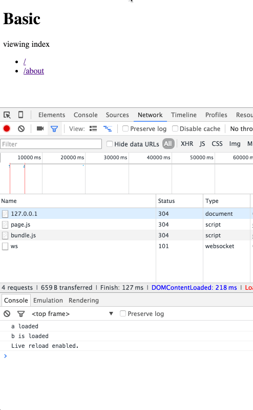

## Links

- [link](https://github.com/webpack/webpack/issues/162)
- [react](http://stackoverflow.com/questions/30263995/webpack-loading-code-split-bundles-on-the-fly)
- [d3 modal](http://stackoverflow.com/questions/33004926/webpack-require-ensure-large-modules)
- [react2](http://blog.netgusto.com/asynchronous-reactjs-component-loading-with-webpack/)
- [lazy angular](http://www.slideshare.net/rsnapp/lazy-angular-w-webpack)
- [lazy angular code](https://github.com/snapwich/lazy-angular-demo)
- [react router Ryan](https://medium.com/@ryanflorence/welcome-to-future-of-web-application-delivery-9750b7564d9f#.8bh16xgvo) and [example](https://github.com/rackt/example-react-router-server-rendering-lazy-routes)

## `ensure`

Let's say we have a client-side router that runs a function on different routes. We have the `index` function that runs when the page loads and the `about` function that runs when we are on the `about` page:


```javascript
function index() {
  document.querySelector('p').textContent = 'viewing index'; /* changes something on the page */
}

/* about function is executed when on the `about` page */
function about() {
  document.querySelector('p').textContent = 'viewing about';
  /* do other things for about page */
}

page.base('/basic');
page('/', index);
page('/about', about);
page();
```

Now, let's say we want to execute more javascript when we are on the about page. You can tell Webpack to do that using `require.ensure` as opposed to vanilla `require`:

```javascript
function about() {
  document.querySelector('p').textContent = 'viewing about';
  // ->
    require.ensure(['./c', './d'], function(require) { /* `c, d` can be syncronously required in the callback */
        require('./c'); /* downloaded and executed on-demand syncronously */
        require('./d'); /* downloaded and executed on-demand syncronously */
        /* 1.bundle.js: downloaded on-demand and contains: `c` and `d` */
    });
}
```

Now when you go to the `about` page, the browser makes a request to get the file that contains module `c` and `d`, and execute the javascript:



As you can see in the gif, `1.bundle.js` is downloaded and executed after navigating to the about page.

**Notes from Official Docs**

The `require.ensure` method ensures that every dependency in dependencies can be synchronously required when calling the callback. callback is called with the `require` function as parameter.

Example:

```javascript
require.ensure(["module-a", "module-b"], function(require) {
    var a = require("module-a");
    // ...
});
```
Note: `require.ensure` only loads the modules, it doesn’t evaluate them.
